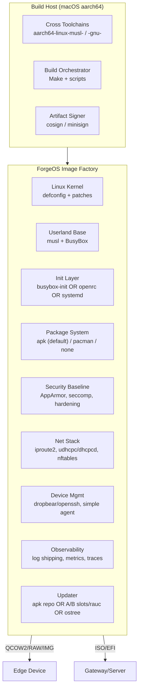

# ForgeOS — Architecture v0.1 (Edge-ready, minimal, reproducible)

**One line:** Lightweight Linux forged for the edge: tiny base, strict security, reproducible builds, and opinionated wiring for IoT/AI workloads.

---

## 1) Goals & non-goals
**Goals**
- **Small, fast boot** (<2s to shell on QEMU/virt; <10s to network on Pi/industrial SBCs).
- **Deterministic builds** (pinned versions, reproducible configs, single `make` entrypoint).
- **Edge-first ops**: offline-friendly, resilient updates, robust logging, safe remote access.
- **Secure by default**: least privilege, signed artifacts, cgroups isolation, MAC (AppArmor).
- **Modular**: choose your libc, init, and package system per “profile”.

**Non-goals**
- Not a general-purpose desktop distro.
- No kitchen-sink: everything opt-in behind profiles.

---

## 2) Target environments
- **Build host:** Apple Silicon (ARM64) macOS; builds via **QEMU/HVF** and/or **Lima VM**.
- **Primary targets:** aarch64 edge devices (Raspberry Pi 5, NXP i.MX8, Ampere, Jetson in “generic” mode), x86_64 for gateways.
- **Boot modes:** QEMU `-M virt`, U-Boot+EFI (boards), GRUB/EFI (x86_64).

---

## 3) High-level component map



---

## 4) Boot & init flow

1. **Firmware/bootloader** (UEFI/BIOS or U-Boot) loads kernel + initramfs.
2. **Kernel bring-up**: DEVTMPFS, VirtIO/board drivers, AppArmor, seccomp.
3. **Initramfs `/init`**:
   - Mounts `proc`, `sysfs`, parses kernel args, mounts root (`/dev/vda`, eMMC, NVMe).
   - Optional: verify root FS signature (dm-verity or fs-verity).
   - `switch_root` to real rootfs.
4. **Init system**:
   - **Profile “Core”**: `busybox init` (fast), `mdev`, `udhcpc`, `agetty`.
   - **Profile “Service”**: `openrc` or **systemd** if you need sockets, timers, cgroups v2.
5. **Early services**: rng seeding, time sync (chrony), networking, firewall baseline.
6. **Optional agents**: SSH, metrics/log shippers, update agent.

---

## 5) Build & packaging strategy

### 5.1 Toolchains
- **musl track (default, small):** `aarch64-linux-musl-*` via musl-cross-make.
- **glibc track (compat):** `aarch64-linux-gnu-*` for maximal ABI compatibility.

### 5.2 Orchestration
- **Makefile** drives: `kernel`, `busybox/userland`, `rootfs`, `initramfs`, `image`, `qemu-run`, `sign`.
- Runs natively on macOS + HVF; optionally in **Lima** for Linux-grade tools (mkfs.ext4, loop mounts).

### 5.3 Package options (choose per profile)
- **apk (Alpine-style, default)**: tiny, musl-friendly, signed index.
- **Immutable options**:
  - **A/B slots** with RAUC (for devices with spare storage).
  - **OSTree** (content-addressed / transactional), good for fleet rollback.

---

## 6) Filesystem layout & profiles

**Base layout**
```
/ (read-mostly)
├─ /usr        (immutable where possible)
├─ /etc        (config; managed by profile templates)
├─ /var        (logs, state)
├─ /opt        (optional apps/containers)
└─ /home
```

**Profiles**
- **core-min**: BusyBox init, mdev, udhcpc, dropbear, apk; no SSH by default (serial only).
- **core-net**: + nftables baseline, chrony, openssh, minimal log shipper.
- **service-sd**: systemd, systemd-networkd, journald (forwarder enabled).
- **iot-field**: + MQTT client/bridge, OPC UA gateway, TLS materials, remote update agent.
- **ai-infer**: + container runtime (nerdctl/containerd), GPU/NPU drivers where available.

Profiles are just **overlay directories** and **package lists** applied at build time.

---

## 7) Security baseline

**Kernel**
- KASLR, `CONFIG_STACKPROTECTOR_STRONG`, `SLUB_DEBUG`, `HARDENED_USERCOPY`.
- AppArmor enabled by default (SELinux optional).
- `CONFIG_SECCOMP` + `CONFIG_SECCOMP_FILTER`.
- `CONFIG_MODULE_SIG` (signed modules) when modules are used.

**Userspace**
- Non-root service users; `doas` or `sudo` with minimal policy.
- `nosuid`, `nodev`, `noexec` mounts where sensible (`/tmp` via `tmpfs,noexec`).
- nftables default-deny except required egress; SSH disabled on “core-min”.
- **Secrets** in `/etc/forgeos/secrets` with `0600`, tmpfs for ephemeral keys.

**Supply chain**
- All packages and images **signed** (cosign/minisign).
- SBOM via `apk` metadata + `syft` at build time (stored in `artifacts/sbom/`).
- Reproducible build flags: `-Wl,--build-id=sha1`, `SOURCE_DATE_EPOCH`.

---

## 8) Networking & IoT plumbing

- **IP**: `iproute2`, DHCP via `udhcpc` (BusyBox) or `systemd-networkd` (sd profile).
- **Firewall**: nftables baseline rules per profile.
- **Discovery** (optional): mDNS/Avahi only in lab profile, **off** in production.
- **Protocols**:
  - MQTT (mosquitto-clients); TLS client bundles preloaded.
  - **Gateway option**: OPC UA → MQTT bridge service (containerized or native).
- **Clock**: chrony (NTP), fallback to hardware RTC if present.

---

## 9) Observability

- **Logs**:
  - BusyBox `syslogd/klogd` → `/var/log` with size-bounded rotation, optional forwarder.
  - systemd profile → `journald` with forwarding to `/var/log` via rsyslog/fluent-bit.
- **Metrics**: node-exporter-lite (textfile + tiny HTTP) or `busybox top` exporter.
- **Traces** (optional): OTLP exporter via a sidecar if needed; disabled by default.

---

## 10) Updates

- **apk path**: Signed repo, delta packages optional; `forgeos-update` applies staged updates, reboots on critical changes.
- **A/B path**: RAUC bundles signed; health checks on boot flip slots automatically.
- **OSTree path**: transactional pull; rollback on failure.

Choose **one** per device class to keep surface area tight.

---

## 11) Device management

- **Access**: serial console first; SSH opt-in (key-only).
- **Config**: `/etc/forgeos/` is the single source of truth; cloud-init-style drop-ins optional.
- **Agent** (optional): minimal gRPC/HTTP agent for command/metrics; sandboxed with seccomp + cgroups.

---

## 12) CI/CD & artifacts

- GitHub Actions (or GitLab CI) matrix:
  - Build profiles (`core-min`, `service-sd`, `iot-field`).
  - Targets (`aarch64`, `x86_64`).
- Outputs:
  - `Image` (kernel), `initramfs.gz`, `root.img` (ext4), `qcow2`, `iso`, SBOM, signatures.
- Release bundles per profile + checksums.

---

## 13) Repository layout (concrete)

```
forgeos/
├─ Makefile
├─ toolchains/                 # helper scripts to fetch/build musl/glibc cross
├─ kernel/                     # git submodule or tarball + patches
│  ├─ patches/
│  └─ configs/aarch64_defconfig
├─ userland/
│  ├─ busybox/                 # submodule
│  ├─ packages/                # custom packages (apk build scripts)
│  └─ overlay-base/            # /etc, init, motd, skeleton
├─ profiles/
│  ├─ core-min/
│  │  ├─ overlay/
│  │  └─ packages.txt
│  ├─ service-sd/
│  ├─ iot-field/
│  └─ ai-infer/
├─ scripts/
│  ├─ build_kernel.sh
│  ├─ build_busybox.sh
│  ├─ mk_initramfs.sh
│  ├─ mk_disk.sh
│  ├─ sign_artifacts.sh
│  └─ qemu_run.sh
├─ security/
│  ├─ apparmor/
│  └─ nftables/
├─ docs/
│  ├─ architecture.md
│  ├─ build-on-macos.md
│  ├─ profiles.md
│  └─ hardening.md
└─ artifacts/                  # CI output (ignored in git)
```

---

## 14) Minimal QEMU bring-up (Apple Silicon)

**Console target:** `ttyAMA0`.  
**Launch (core-min profile):**
```bash
qemu-system-aarch64 -M virt -cpu max -accel hvf -m 1024   -kernel artifacts/arch/arm64/boot/Image   -initrd artifacts/initramfs.gz   -append "console=ttyAMA0"   -nographic -serial mon:stdio
```

Add a virtio disk (`root.img`) and pivot in `/init` when you’re ready.

---

## 15) Threat model (baseline)
- **Assume hostile LAN**: firewall default-deny inbound, minimal egress.
- **Assume physical access on some devices**: encrypted state (where HW allows), signed updates, measured boot when TPM/TrustZone available.
- **Remote compromise mitigation**: read-only `/usr`, ephemeral `/tmp`, service sandboxes, rapid rollback.

---

## 16) Roadmap (short)
- v0.1: boots in QEMU, BusyBox init, DHCP, SSH optional, apk updates, nftables baseline.
- v0.2: profile system, signed apk repo, SBOM in CI, AppArmor policies for base daemons.
- v0.3: A/B or OSTree track for devices that need transactional updates.
- v0.4: OPC UA→MQTT bridge profile, metrics/log forwarders, remote agent with seccomp.

---

## 17) Naming & UX polish
- Tagline: **“Lightweight Linux, forged for the edge.”**
- Versioning: semver with profile suffixes, e.g., `v0.2-core-min-aarch64`.
- MOTD shows profile, kernel, and update channel.
